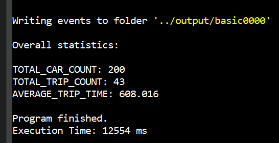

# Decentralized Traffic Detection

## Project overview
I will simulate a road network and test the effectiveness of decentralized traffic detection (DTD) through car-to-car communication of local slowdowns. I will also determine the minimum density of DTD users necessary for effective decentralized traffic detection.

## Requirements
The simulation program requires C++11 or higher.

The web server requires Node.js.
https://nodejs.org/en/

## Installation instructions
Clone this repository from GitHub
```
cd web
npm install
```

## Run instructions
1. Navigate to the root folder of this repo
2. Run the following commands
```
cd code/build
cmake .. && make
./main < input.txt
cd ../../web
npm start
```
3. Navigate in your favorite web browser to `localhost:8080/`
4. Enter the simulation name and index from `./main < input.txt` into the website (`basic` and `0000` in the example)

5.
